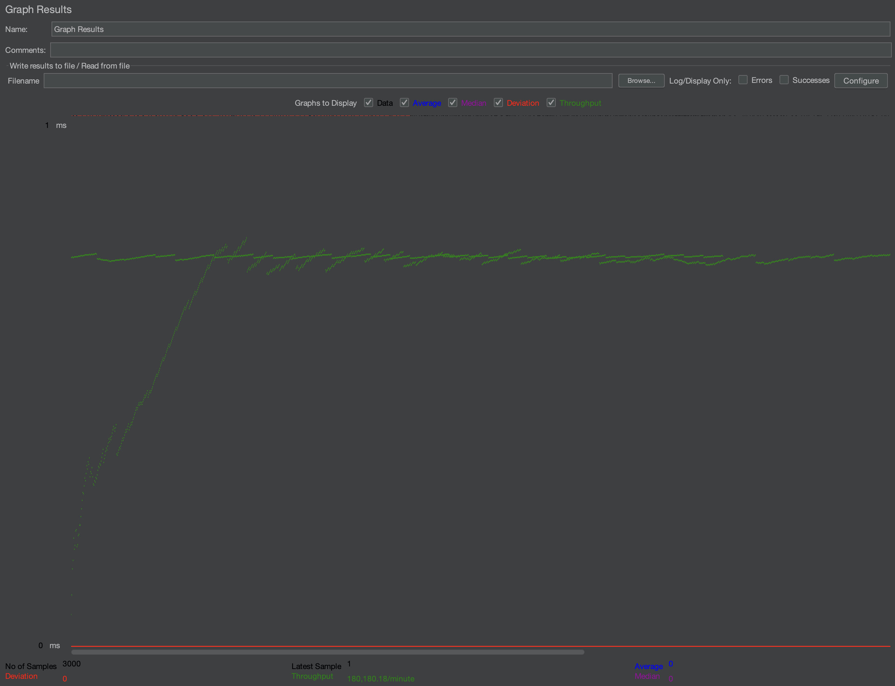

# Dcard 2024 Backend Intern Assignment

> 作者：周宸宇

> 學歷：政治大學 資訊科學系 資訊科學與工程組研究所

> 撰寫日期：2024/02/15

## 系統概覽

透過 RESTful API，允許創建、查詢廣告，並可以設定特定條件進行篩選，在**對資料庫進行操作之前，進行參數驗證**，如格式錯誤就返回錯誤訊息，如此可以**減低資料庫無效的操作。**

## 文件結構

項目的文件結構如下所示：
```
dcard/
│
├── config/
│ └── config.go # 連接至 Redis 的設定常數
│
├── handlers/
│ ├── admin.go # 處理創建廣告請求的 Admin API
│ └── public.go # 處理廣告檢索的 Public API
│ └── reset_counter.go # 使用API的方式重置創建廣告數量的計數
│
├── models/
│ └── ad.go # 定義廣告結構
│
├── storage/
│ └── redis.go # Redis 相關操作，如保存和檢索廣告
│
├── main.go # 設置router和啟動server
│
├── go.mod 
└── go.sum 
```


## 設計決策

### 廣告模型 (`models/ad.go`)

廣告模板定義了廣告的資料結構，包括標題、開始時間、結束時間以及條件。條件設定允許設置年齡範圍、性別、國家、用戶平台、limit和offset。

### 檢索與儲存方式 (`storage/redis.go`)

我選擇 Redis 作為廣告資料的儲存方案，因其提供了快速的資料讀寫能力，適合這種需要高速讀取資料的場景。當使用者的格式正確後才正式啟動資料庫操作，如：資料檢索、資料儲存、資料排序

### 路由和處理函數 (`handlers/`)

- `admin.go` 創建廣告的 Admin API，驗證請求的 JSON 格式，並調用redis.go保存廣告。
- `public.go` 檢索廣告的 Public API，根據請求參數從 Redis 中檢索和過濾廣告。
- `reset_counter.go` 用於重置資料庫儲存上限，提供開發者測試創建廣告上限功能是否正常，對應需求「每天 create 的廣告數量 不會超過 3000 個」

### 配置管理 (`config/config.go`)

配置管理文件包含了連接到 Redis 的相關配置，如伺服器IP、密碼和資料庫編號編號。

### 入口 (`main.go`)

主程式設定了router，並啟動了 Gin Web Server。所有的API都映射到相應的處理函數，如創建、檢索廣告

## 性能考量

- 使用Redis：因為所有資料都存儲在記憶體中，讀寫速度非常快，這使得高頻次讀寫操作的性能得到極大提升。
- Go 語言的 context : 提供了上下文管理的功能，這對於控制和管理長時間運行的操作或高並發環境下的請求非常重要。


## 安全性和錯誤處理

在 API 處理函數中，我們對輸入進行了嚴格的驗證，確保只有符合要求的資料才會被處理和儲存。同時，系統中加入了適當的錯誤處理邏輯，確保任何操作異常都會返回適當的錯誤資訊。


## API 規格表

API 設計遵循 RESTful 原則，提供清晰和一致的端點用於廣告的創建和檢索。透過 `admin.go` 和 `public.go` 中定義的端點，用戶可以輕鬆地與廣告服務進行互動，無論是添加新的廣告還是查詢符合特定條件的廣告。

### 廣告創建 (`POST /api/v1/ad`)

|屬性|描述|
|----|----|
|方法|POST|
|路徑|/api/v1/ad|
|描述|允許用戶提交廣告信息，並將其存儲在系統中。
|Header|Content-Type: application/json
|Body|JSON 格式，包含廣告的詳細信息。
|成功狀態|HTTP 201 Created，返回創建的廣告信息。
|失敗狀態|HTTP 400 Bad Request，返回錯誤信息。
```code=
{
  "title": "廣告標題",
  "startAt": "YYYY-MM-DDTHH:MM:SSZ",
  "endAt": "YYYY-MM-DDTHH:MM:SSZ",
  "conditions": {
    "ageStart": 18,
    "ageEnd": 24,
    "gender": "M",
    "country": ["TW", "JP"],
    "platform": ["android", "ios"]
  }
}
```


### 廣告檢索 (`GET /api/v1/ad`)

|屬性|描述|
|----|----|
|方法|GET|
|路徑|/api/v1/ad|
|描述|根據提供的條件檢索並返回符合條件的廣告列表。
|查詢參數|age, gender, country, platform, limit, offset（均為可選）
|成功狀態|HTTP 200 OK，返回符合條件的廣告列表。
|失敗狀態|HTTP 400 Bad Request，返回錯誤信息。

#### 查詢參數說明
- age: 年齡範圍，整數，1~100 之間。
- gender: 性別，M 或 F。
- country: 國家代碼，字符串。
- platform: 平台，如 android、ios 或 web。
- limit: 返回結果的最大數量，整數。
- offset: 結果的起始偏移量，整數。

## 性能測試（使用JＭeter）
### 實驗一（GET測試）

參數設定如下
- Number of Threads：100
- Ramp-up period(seconds)：1
- Loop Count：100
- Method：GET
- Path：http://localhost:8080/api/v1/ad
- Total Request：100*100
> **測試結果：通過**


### 實驗二（Post測試）

參數設定如下
- Number of Threads：100
- Ramp-up period(seconds)：1
- Loop Count：30
- Method：POST
- Path：http://localhost:8080/api/v1/ad
- Total Request：100*30
> **測試結果：通過**



## Unit Test
Postman Link：https://reurl.cc/g4x1XX
Postman_collection.json Download：https://reurl.cc/M49Vem
Unit Test code: https://reurl.cc/09n5KK
```code=
//以下僅為Unit Test code之程式碼片段，全部程式碼請點https://reurl.cc/09n5KK
package main

import (
	"fmt"
	"io/ioutil"
	"net/http"
	"strings"
)

func main() {

	payload := `{
		"title": "0010",
		"startAt": "2023-01-01T00:00:00Z",
		"endAt": "2024-12-11T23:59:59Z",
		"conditions": {
			"ageStart": 1,
			"ageEnd": 20,
			"gender": "M",
			"country": ["TW"],
			"platform": ["ioss"]
		}
	}`

	url := "http://localhost:8080/api/v1/ad?platform=12"

	test_post_error_gender(payload)
        test_get_error_age(url)
}

func test_post_error_gender(payload string) {
	url := "http://localhost:8080/api/v1/ad"
	method := "POST"
	expect := `{"error":"Gender must be 'M' or 'F'"}`

	client := &http.Client{}
	req, err := http.NewRequest(method, url, strings.NewReader(payload))

	if err != nil {
		fmt.Println(err)
		return
	}
	req.Header.Add("Content-Type", "application/json")

	res, err := client.Do(req)
	if err != nil {
		fmt.Println(err)
		return
	}
	defer res.Body.Close()

	body, err := ioutil.ReadAll(res.Body)
	if err != nil {
		fmt.Println(err)
		return
	}

	bodyString := string(body)

	if expect == bodyString {
		fmt.Println("預期結果：" + expect + "\n測試結果：" + bodyString + "\n測試通過")
	} else {
		fmt.Println("預期結果：" + expect + "\n測試結果：" + bodyString + "\n測試失敗")
	}
}

func test_get_error_age(url string) {
	method := "GET"
	expect := `{"error":"Invalid 'age' parameter, must be an integer between 1 and 100"}`

	client := &http.Client{}
	req, err := http.NewRequest(method, url, nil)

	if err != nil {
		fmt.Println(err)
		return
	}
	req.Header.Add("Content-Type", "application/json")

	res, err := client.Do(req)
	if err != nil {
		fmt.Println(err)
		return
	}

	defer res.Body.Close()

	body, err := ioutil.ReadAll(res.Body)
	if err != nil {
		fmt.Println(err)
		return
	}

	// fmt.Println(string(body))
	bodyString := string(body)

	if bodyString == expect {
		fmt.Println("預期結果：" + expect + "\n測試結果：" + bodyString + "\n測試通過")
	} else {
		fmt.Println("預期結果：" + expect + "\n測試結果：" + bodyString + "\n測試失敗")

	}
}
```
